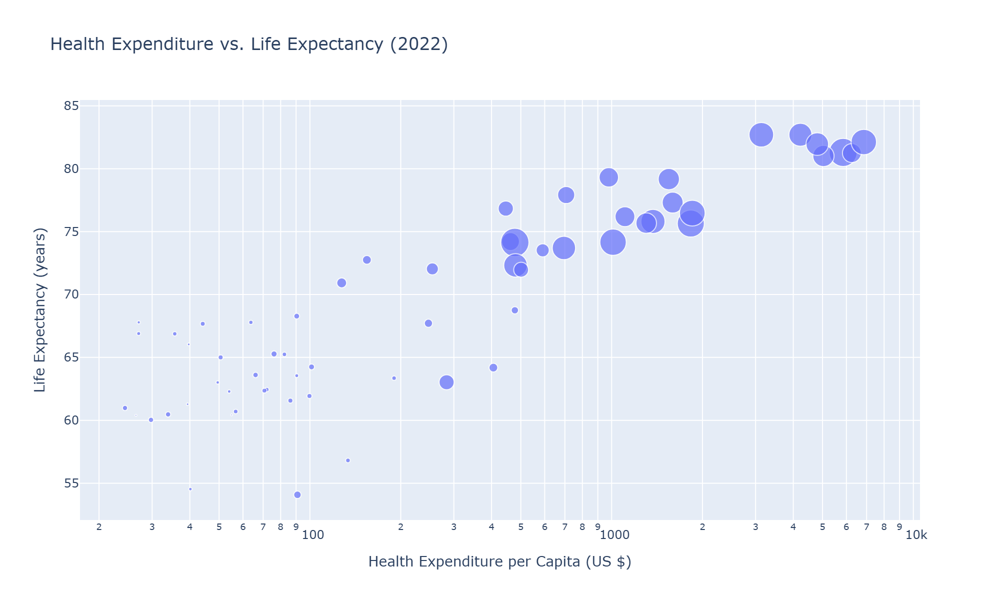
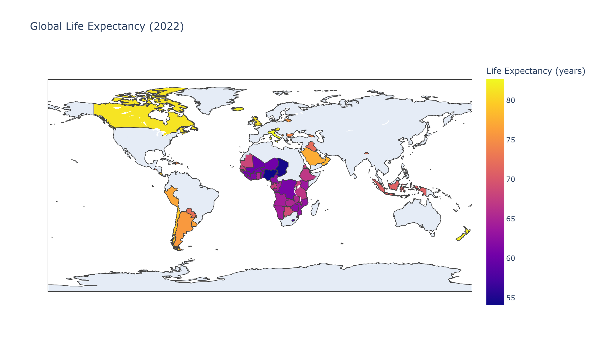

# Decoding Global Health: A Data Analysis

🌐 **Live Project Website:** [https://reens4325.github.io/global-health-analysis/](https://reens4325.github.io/global-health-analysis/)

## Overview
This project analyzes the relationship between national health expenditure, physician density, and life expectancy using World Bank data from 2000-2022. The analysis explores global trends and identifies interesting outliers.

## Key Questions
- How strong is the correlation between health spending and life expectancy?
- How does the United Kingdom compare to countries with similar health expenditures?

## Key Findings
- **Strong Positive Correlation:** A Pearson's r value of 0.723 was found between health expenditure per capita and life expectancy.
- **UK Efficiency:** Despite ranking last in physician density among its spending peers, the UK maintains a high life expectancy, suggesting systemic efficiency.

## Visualizations

### 1. Health Expenditure vs. Life Expectancy (2022)

This interactive scatter plot explores the core relationship of this project:
- **X-Axis:** Health Expenditure per Capita (log scale).
- **Y-Axis:** Life Expectancy.
- **Dot Size:** Represents the number of Physicians per 1,000 people.
- **Dot Color:** Also represents Physicians per 1,000 people (reinforcing the size encoding).

**Key Insights from this plot:**
- A strong, positive correlation is visually confirmed, supporting our calculated Pearson's r of 0.723.
- The "cloud" of data points shows a clear upward trend but also significant variation, especially at lower expenditure levels.
- The UK (highlighted) is a notable case, achieving high life expectancy despite a lower physician density compared to its spending peers.

*This plot is interactive in the Jupyter notebook, allowing for detailed exploration of every country's data.*

### 2. Global Life Expectancy (2022)

This choropleth map illustrates the stark global inequalities in health outcomes. The clear geographical pattern shows:
- **Higher life expectancy** (yellow/red) concentrated in North America, Europe, and Oceania.
- **Lower life expectancy** (blue/purple) prevalent across many parts of Africa.
- This visual immediately contextualizes the analysis, highlighting that the relationship between wealth and health is also a story of **global development and inequality**.

*Note: The map is interactive in the Jupyter notebook, allowing users to hover and see exact values for each country.*

## Technologies Used
- **Python** (Primary Language)
- **Pandas** (Data Wrangling and Analysis)
- **NumPy** (Numerical Operations)
- **Matplotlib & Seaborn** (Static Visualization)
- **Plotly** (Interactive Visualization)
- **SciPy** (Statistical Calculation - Pearson's Correlation)
- **Jupyter Notebook** (Interactive Development Environment)

## How to Run
1. Clone this repository.
2. Install dependencies: `pip install -r requirements.txt`
3. Open and run `global_health_analysis.ipynb` in Jupyter.

## Data Source
All data was sourced from the World Bank's Open Data platform.